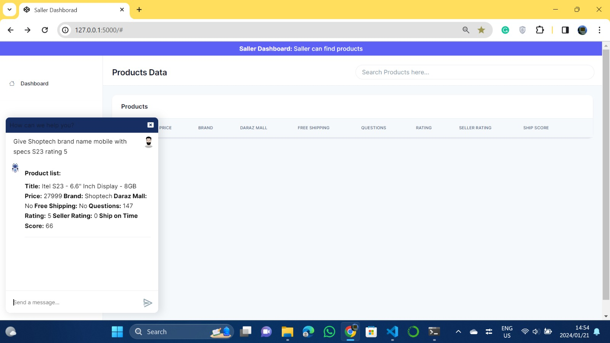
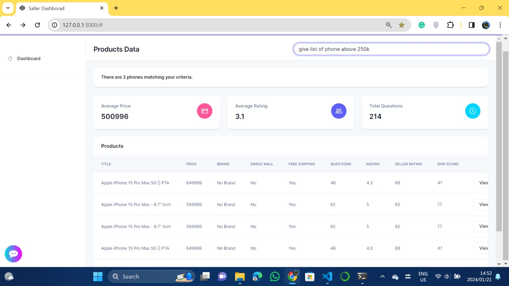
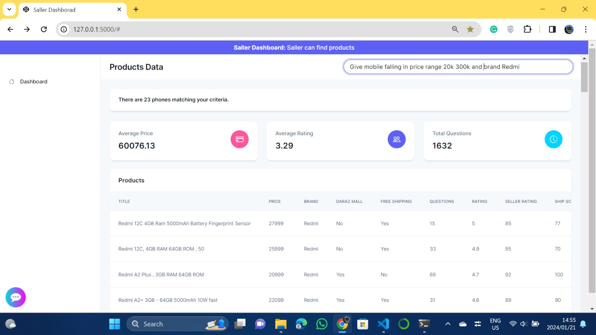

# 📱 phone-query_Flask_Chatbot

A **Flask-based chatbot** that answers user queries related to mobile phones using data from the **Daraz dataset(scraped via selenium)**. This project demonstrates natural language processing and machine learning for simple query resolution.

---

## 🚀 Features
- Built with **Flask** for lightweight web interaction.
- Uses **NLTK** and **scikit-learn** for natural language understanding.
- Queries are answered based on a structured mobile phone dataset from Daraz.
- Easy to set up and run locally.

---

## 🧰 Prerequisites

Ensure the following are installed on your system:

- Python 3.x  
- (Optional) Virtual Environment

### 📦 Required Libraries

Install dependencies via pip:

```bash
pip install Flask
pip install pandas
pip install numpy
pip install nltk
pip install scikit-learn
```

---

## 🛠️ How to Run

Follow these steps to run the chatbot:

1. Open a terminal or command prompt.
2. Navigate to the folder containing the project.
3. (Recommended) Activate your virtual environment:
   ```bash
   .venv\Scripts\activate
   ```
4. Run the Flask app:
   ```bash
   py -m flask run --debug
   ```

The app will launch on `http://127.0.0.1:5000/` by default. Open this in your browser to start chatting!

---

## 🖼️ Screenshots

Below are some sample interface visuals of the chatbot:

- 
- 
- 
- 

---

## 📂 Dataset

The chatbot uses a cleaned dataset derived from Daraz mobile listings. Make sure the dataset file is present in the project directory before running the app.

---

## 🤝 Contribution

Feel free to fork this repository, suggest improvements, or open issues for any bugs or enhancement ideas!
